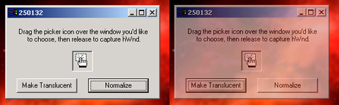



## VisualEffects \#1 \- The Translucency

### Description

Make a form, image, controls transparent. Make another window transparent by retrieving it's handle. Make a form disapear by fading smoothly into the background. Please vote. Next week, I'll post how to create a plasma effect on forms.
 
### More Info
 

             |
---                |---
**Submitted On**   |2001-01-03 14:29:34
**By**             |[N/A](https://github.com/Planet-Source-Code/PSCIndex/blob/master/ByAuthor/empty.md)
**Level**          |Advanced
**User Rating**    |3.9 (39 globes from 10 users)
**Compatibility**  |VB 6\.0
**Category**       |[Graphics](https://github.com/Planet-Source-Code/PSCIndex/blob/master/ByCategory/graphics__1-46.md)
**World**          |[Visual Basic](https://github.com/Planet-Source-Code/PSCIndex/blob/master/ByWorld/visual-basic.md)
**Archive File**   |[CODE\_UPLOAD13320132001\.zip](https://github.com/Planet-Source-Code/visualeffects-1-the-translucency__1-14077/archive/master.zip)

### API Declarations

See Code

